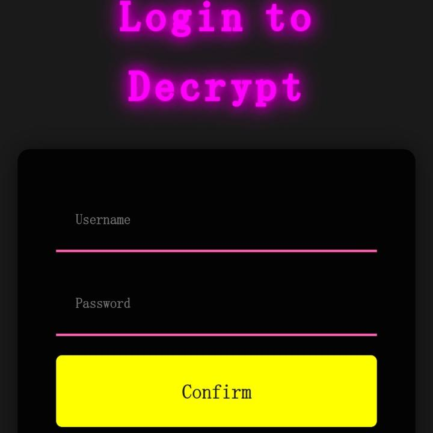
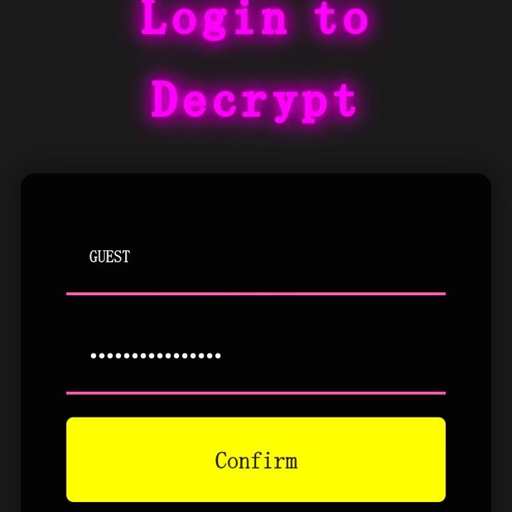
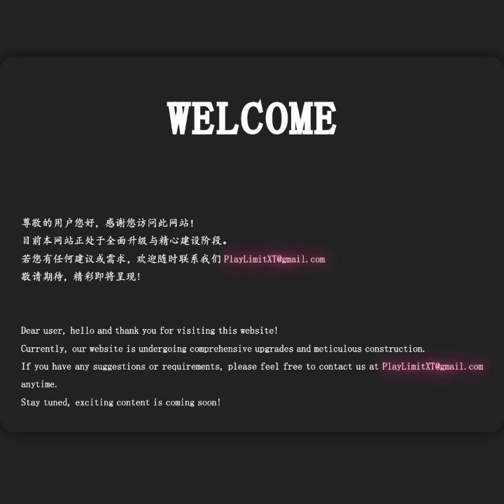
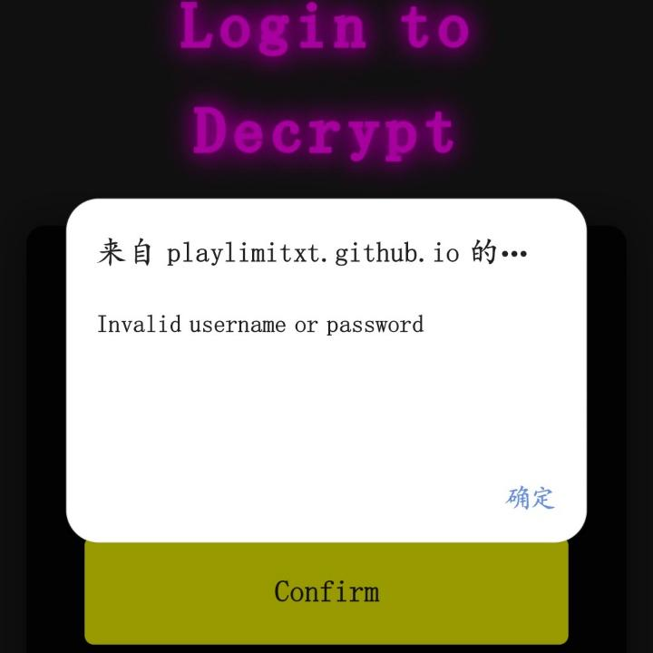

#  纯前端登录页面 - Play_Limit 原创
## 前言
我们都知道，一个登录的页面和操作涉及前端的网页设计，也依赖后端和服务器的操作，没有其中任何一项，这个项目都不可能完成，但我们依旧可以使用一些方法只使用前端来制作一个伪登录页面
## 效果展示
> 效果图



> 输入账号密码



> 登录并进入页面



> 提示"错误账号或密码错误"



你也可以在此访问我们的网站[Login - Play_Limit 个人网站](https://playlimitxt.github.io/Project/Key)体验

输入用户名:`username`和密码:`password`

或者用户名:`GUEST`和密码:`@ACCOUNT_#GUEST#`

访问我们的两个不同隐藏页面

## 具体用处
纯前端登录页面是做不到真正的"登录"的，那这有什么用呢？
纯前端登录重点在于"纯前端"，如果你的网站像我们的一样或类似(Github Pages搭建)，那你可能是没有后端服务的，依旧像搭建一个登录且切实可用的登录页面时，这是最好的选择！

## 原理详解

输入用户名和密码即可打开一个页面，实际上是加载了一个HTML页面，假设我们加载的HTML代码存储在一个名为`HTML_Source_Code`的变量中，我们可以使用如下JS代码即可加载该HTML页面
```js
const newWindow = window.open("", "_blank");
newWindow.document.write(HTML_Source_Code);
```
重点的问题是我们如何保证输入用户名和密码能获得这串HTML代码，且唯一对应这一串，且要保持安全

我们创建了一个名为`Pages`的文件夹，用于保存所有隐藏页面，每一个用户对应了一个页面，用户名实际是网页的文件名(当然你也可以用其他方式命名，只需做到每一个用户名对应一个页面即可)，当然源码不可能直接存放在里面，那样密码就形同虚设了。我们使用AES和一个设定好的密钥加密源码后，再存储在每个文件中

此时，我们要访问HTML源码的步骤就是
- 读取用户输入
- 通过用户输入的用户名找到对应的加密源码
- 用用户输入的密钥去尝试解密源码
- 将解密后的HTML网页展示(同上)

这样，我们就能先获取用户输入的用户名和密码

```html
<input type="text" id="username" placeholder="Username">
<input type="password" id="password" placeholder="Password">
```

```js
const username = document.getElementById("username").value;
const password = document.getElementById("password").value;
```

然后，获取加密源码
```js
const encryptedHTML = await fetch('./Pages/${username}.txt').then(res => res.text());
```

接着，使用`Crypto-JS`库来AES解密
```html
<script src="https://cdnjs.cloudflare.com/ajax/libs/crypto-js/4.1.1/crypto-js.min.js"></script>
```
```js
const decryptedHTML = CryptoJS.AES.decrypt(
    encryptedHTML,
    CryptoJS.enc.Utf8.parse(password), {
        mode: CryptoJS.mode.ECB,
        padding: CryptoJS.pad.Pkcs7
        //此处使用的方法为ECB模式，Pkcs7填充，Base 64编码，可根据实际情况修改
    }
);
const HTML_Source_Code = decryptedHTML.toString(CryptoJS.enc.Utf8);
```

再用上午已提及到的方法显示出HTML网页即可

最后加入一个在失败之后执行的操作即可(失败往往意味着 用户名和密码错误)
```html
<p id="error-message" class="hidden"></p>
```
```js
try {
  //AES解密
} catch (error) {
  const errorMessage = document.getElementById("error-message");
  errorMessage.textContent = "Invalid username or password";
  errorMessage.classList.remove("hidden");
  alert("Invalid username or password");
}
```
至此，我们这个纯前端伪登录页面也就完成了

它做到了纯前端且具备一定的安全性(隐藏页面是密文存储的)
你可以使用它来为你设计一个只有获得密钥的人才能访问的网页！

最后附上完整源码，附赠精美CSS，未经作者授权禁止转载！

```html
<!DOCTYPE html>
<html lang="en">
<head>
  <meta charset="UTF-8">
  <title>Encrypted Pages</title>
  <meta name="viewport" content="width=device-width, initial-scale=1.0">
  <link rel="stylesheet" href="style.css">
  <meta name="author" content="Play_Limit,PlayLimitXT@gmail.com">
  <meta name="copyright" content="Copyright © 2024 Play_Limit">
  <script src="https://cdnjs.cloudflare.com/ajax/libs/crypto-js/4.1.1/crypto-js.min.js"></script>
</head>
<body>
  <div class="container">
    <h1>Login to Decrypt</h1>
    <form id="login-form">
      <input type="text" id="username" placeholder="Username">
      <input type="password" id="password" placeholder="Password">
      <button type="submit">Confirm</button>
    </form>
    <p id="error-message" class="hidden"></p>
    <iframe id="decoded-content" class="hidden"></iframe>
  </div>
  <script src="script.js"></script>
</body>
</html>
```

```js
document.addEventListener("DOMContentLoaded", function () {
  const form = document.getElementById("login-form");
  const errorMessage = document.getElementById("error-message");
  const decodedContent = document.getElementById("decoded-content");
  form.addEventListener("submit", async function (event) {
    event.preventDefault();
    errorMessage.classList.add("hidden");
    const username = document.getElementById("username").value;
    const password = document.getElementById("password").value;
    try {
      const encryptedHTML = await fetch(`./Pages/${username}.txt`).then(res => res.text());
      var decryptedHTML = CryptoJS.AES.decrypt(
        encryptedHTML,
        CryptoJS.enc.Utf8.parse(password), {
          mode: CryptoJS.mode.ECB,
          padding: CryptoJS.pad.Pkcs7
        }
      );
      decryptedHTML = decryptedHTML.toString(CryptoJS.enc.Utf8);
      const newWindow = window.open("", "_blank");
      newWindow.document.write(decryptedHTML);
    } catch (error) {
      errorMessage.textContent = "Invalid username or password";
      errorMessage.classList.remove("hidden");
      alert("Invalid username or password");
    }
  });
});
```

```css
body,html {
	margin: 0;
	padding: 0;
	font-family: Arial,sans-serif;
	background-color: #1a1a1a
}
.container {
	display: flex;
	flex-direction: column;
	justify-content: center;
	align-items: center;
	min-height: 100vh;
	padding: 2rem;
	animation: glow-background 5s ease-in-out infinite alternate
}
h1 {
	color: #f0f;
	text-align: center;
	font-size: 3rem;
	margin-bottom: 1.5rem;
	letter-spacing: .1em;
	text-shadow: 0 0 10px #f0f,0 0 20px #f0f
}
form#login-form {
	display: flex;
	flex-direction: column;
	width: 100%;
	max-width: 400px;
	border-radius: 10px;
	box-shadow: 0 0 20px rgba(0,0,0,.5);
	padding: 2rem;
	background-color: rgba(0,0,0,.9)
}
input[type=password],input[type=text] {
	width: 100%;
	box-sizing: border-box;
	width: 100%;
	padding: 1rem;
	margin-bottom: 1rem;
	border: none;
	border-bottom: 2px solid #ff69b4;
	background-color: transparent;
	color: #fff;
	outline: 0;
	transition: all .3s
}
input[type=password]:focus,input[type=text]:focus {
	border-bottom-color: #0ff
}
button[type=submit] {
	cursor: pointer;
	padding: 1rem 2rem;
	border: none;
	border-radius: 5px;
	background-color: #ff0;
	color: #1a1a1a;
	font-size: 1.2rem;
	box-shadow: 0 5px 15px rgba(0,0,0,.5);
	transition: all .3s
}
button[type=submit]:hover {
	background-color: gold;
	transform: translateY(-2px)
}
.hidden {
	display: none
}
@media screen and (max-width:768px) {
	h1 {
		font-size: 2.5rem
	}

	form#login-form {
		max-width: 90%
	}
}
```

> 转载请标明原文出处
>
> Copyright © 2024 Play_Limit