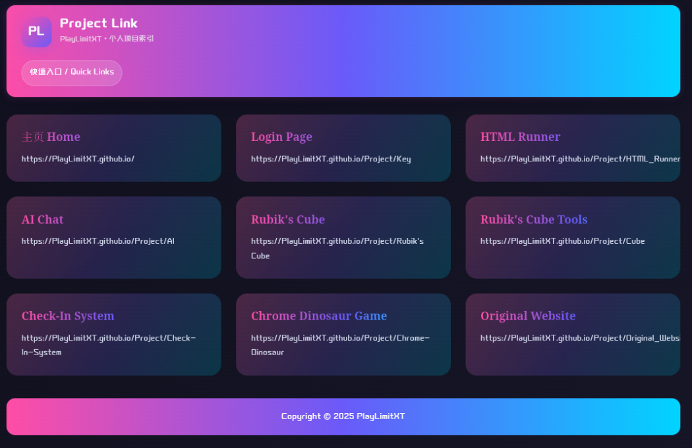
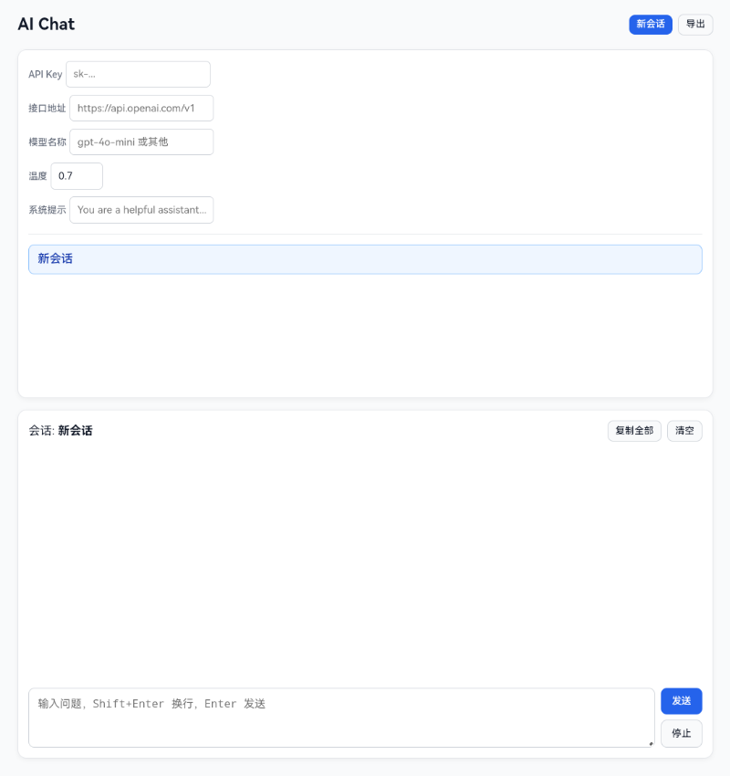
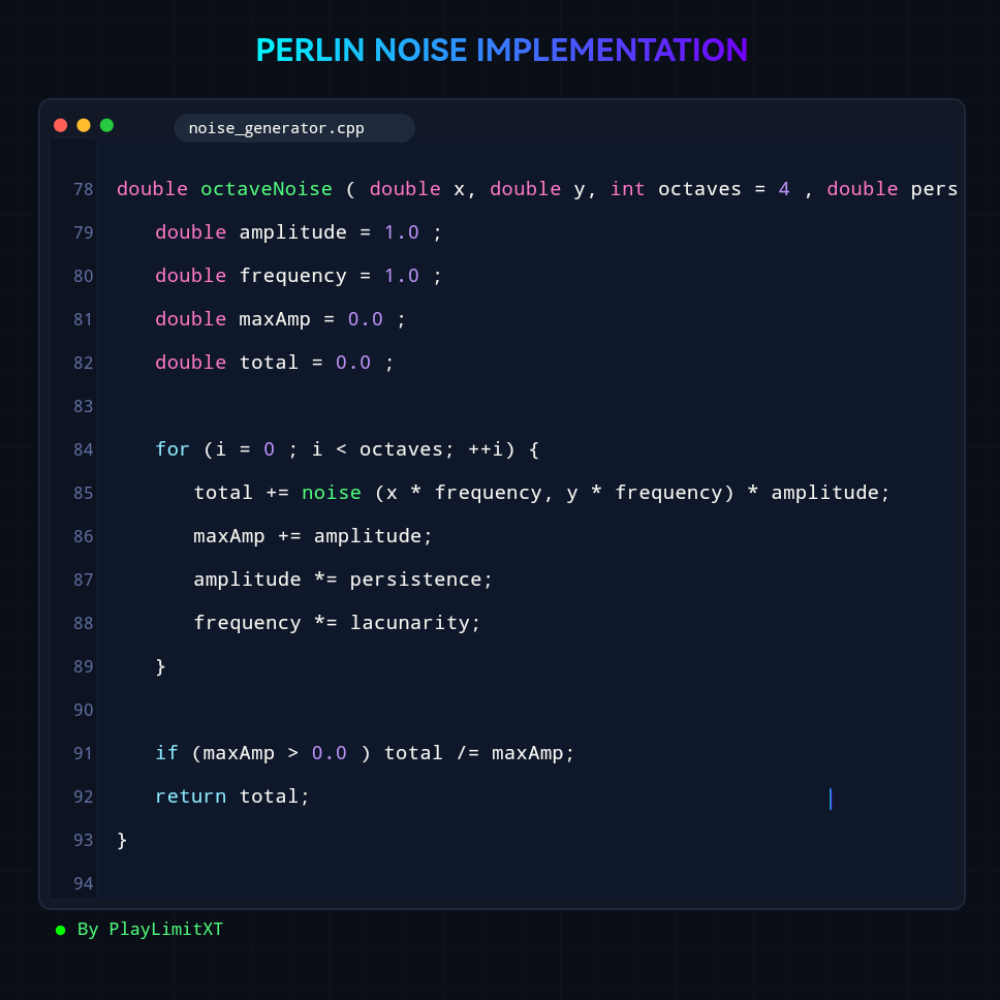
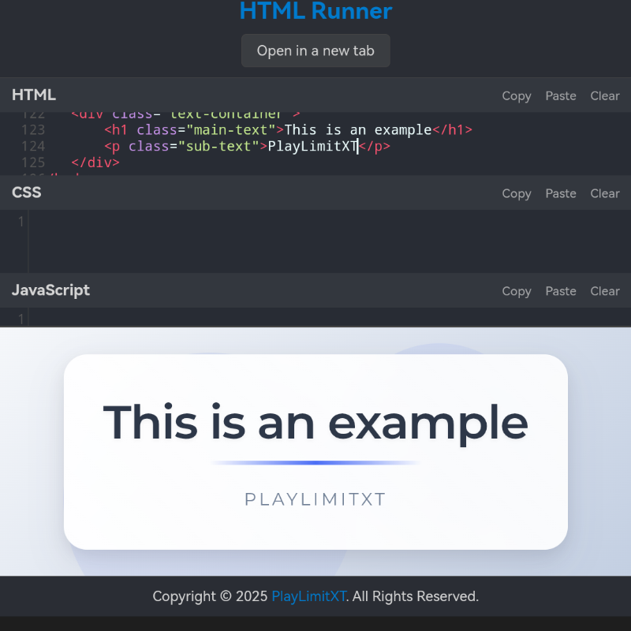

# 本网站最近的一些更新以及相关源码内容
Some recent updates and related source codes of this website.
> 本文最后更新于：**2025.09.22**

----

## Logo重设计

> 预览图


> SVG源文件

```svg
<svg width="2000" height="500" viewBox="-143.75 -35 2000 500" xmlns="http://www.w3.org/2000/svg">
    <defs>
        <linearGradient id="X" x1="885" y1="885" x2="225" y2="225" gradientUnits="userSpaceOnUse">
            <stop offset="0" stop-color="#00aaff"></stop>
            <stop offset="1" stop-color="#ff00ff"></stop>
        </linearGradient>
    </defs>

    <g id="svgGroup" stroke-linecap="round" fill-rule="evenodd" font-size="9pt" stroke="#000000" stroke-width="0.25mm" fill="#000000" style="stroke:#000000;stroke-width:0.25mm;fill:#000000">
        <path fill="url(#X)" d="M 1157 417.5 L 1107 392.5 L 1084 349 L 1051 421.5 L 955 430 L 905 405 L 1005 197 L 915.5 23.5 L 1013 15 L 1063 40 L 1073.5 60 L 1094 12.5 L 1190.5 4 L 1240.5 29 L 1155 211.5 L 1258.5 409 L 1157 417.5 Z M 1099.5 187 L 1182 10 L 1097 17.5 L 1058 109.5 L 1010 20.5 L 923 28 L 1010.5 196.5 L 913.5 399 L 997.5 392 L 1051.5 274 L 1110 387.5 L 1200 379.5 L 1099.5 187 Z M 1545 420 L 1495 395.5 L 1495 128.5 L 1463.5 131 L 1413.5 106 L 1413.5 22 L 1662.5 0 L 1712.5 25 L 1712.5 109 L 1631 116 L 1631 412 L 1545 420 Z M 50 427 L 0 402 L 0 22 L 129.5 10.5 Q 132.5 10 135.25 10 L 141 10 Q 161 10 179.5 16 A 321.744 321.744 0 0 1 203.406 24.867 A 402.715 402.715 0 0 1 218.5 31.5 A 168.557 168.557 0 0 1 242.783 44.576 Q 257.284 54.068 268.019 65.952 A 113.745 113.745 0 0 1 277 77.25 Q 292.078 98.925 295.789 130.404 A 184.572 184.572 0 0 1 297 152 A 215.153 215.153 0 0 1 295.242 180.103 Q 290.444 216.51 272.548 242.275 A 116.136 116.136 0 0 1 265 252 A 116.615 116.615 0 0 1 205.596 288.816 A 154.939 154.939 0 0 1 178 293.5 L 136 297 L 136 419.5 L 50 427 Z M 555 425.5 L 505 400.5 L 505 20.5 L 590.5 13 L 640.5 38 L 640.5 304.5 L 710.5 298.5 L 760.5 323.5 L 760.5 408 L 555 425.5 Z M 1576 86.5 L 1657.5 79.5 L 1657.5 5.5 L 1418.5 26.5 L 1418.5 100.5 L 1500 93.5 L 1500 390 L 1576 383.5 L 1576 86.5 Z M 705.5 304 L 585.5 314.5 L 585.5 18.5 L 510 25 L 510 395.5 L 705.5 378.5 L 705.5 304 Z M 81 267.5 L 127.5 263.5 A 150.392 150.392 0 0 0 155.407 258.6 Q 189.459 249.085 211.5 223.25 A 117.953 117.953 0 0 0 232.878 185.77 Q 241.43 161.691 241.964 131.107 A 235.046 235.046 0 0 0 242 127 Q 242 93.5 230 68.5 A 95.404 95.404 0 0 0 206.847 37.579 A 92.616 92.616 0 0 0 195.75 29.25 A 88.265 88.265 0 0 0 164.434 17.025 A 119.027 119.027 0 0 0 142 15 L 136 15 Q 133 15 130 15.5 L 5 26.5 L 5 397 L 81 390.5 L 81 267.5 Z M 81 196 L 81 92 L 115 89 A 26.551 26.551 0 0 0 118.75 88.75 Q 120.5 88.5 122 88.5 Q 140.5 88.5 151.25 99.25 Q 162 110 162 136.5 A 87.807 87.807 0 0 1 160.615 152.681 Q 157.676 168.324 148.5 177.5 Q 135 191 115 193 L 81 196 Z M 136 121.5 L 136 181.5 Q 146 174.5 151.5 164 A 45.829 45.829 0 0 0 155.792 151.009 A 80.122 80.122 0 0 0 157 136.5 A 101.069 101.069 0 0 0 156.551 126.361 A 45.586 45.586 0 0 0 155.5 120 L 136 121.5 Z"/>
    </g>
</svg>
```

- 使用的字体为`RampartOne-Regular`
- 字体来源：`Google Font`
- 渐变配色：`#00aaff` + `#ff00ff`

## Project Link 页面重设计

更加现代化的设计以及霓虹配色

同时配备丰富美观的动画效果

您可以前往[Project Link](https://playlimitxt.github.io/Link.html)观赏体验

> 预览图



## AI Chat 网页

一个兼容OpenAI接口API的AI Chat网站

前往您选择的大模型的管理后台，找到并在此网站输入您的`Api Key`，`接口地址`，以及`模型`，即可开始聊天

基础功能已完善，实测可以正常使用

您输入的数据及聊天数据等均保存在您的浏览器本地保存，无需担心数据泄露

您可以前往[AI - PLXT](https://playlimitxt.github.io/Project/AI/index.html)开始使用

> 预览图



## 其他SVG图片

主页[PlayLimitXT个人网站](https://playlimitxt.github.io/)的项目介绍栏目中使用了此SVG图片，而并非直接截图

> 预览图



图片链接：[Link](https://playlimitxt.github.io/images/gallery/1.svg)

## HTML Runner 页面

一个可以实时运行预览静态网页`HTML+CSS+JS`的工具

在上方输入框输入代码，可直接在下方的`<iframe>`内Preview

亦可以点及上方`Open in a new tab`按钮，打开一个新标签页运行，使用了`blob:`的方式

同样，数据均存储在本地，无需后端支持，同时保障了用户数据的安全性

开始使用：[HTML Runner](https://playlimitxt.github.io/Project/HTML_Runner/index.html)

> 预览图



----

## 声明

由于网页源码长度，本页面暂不直接列出。

如有需要请自行打开对应页面链接，使用您的浏览器开发者工具或资源嗅探工具获取网页源码

----

本页面提供内容仅供学习交流使用。

以上内容如需转载或使用请标明出处！

> Copyright © 2025 PlayLimitXT
