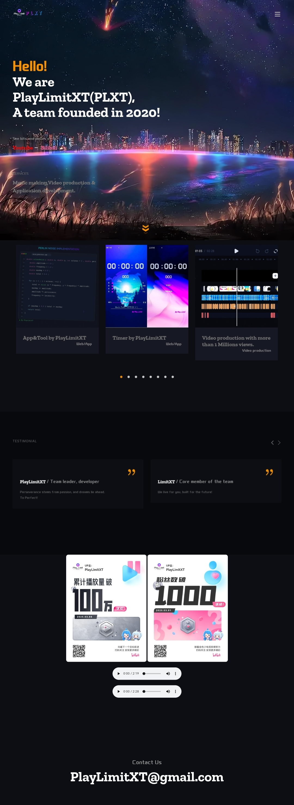
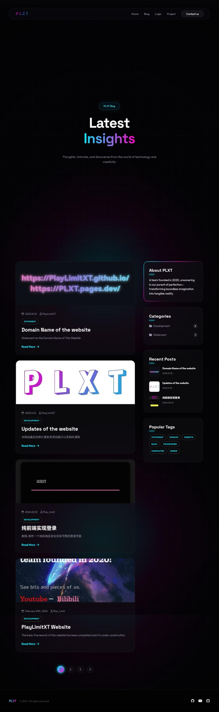

# Development Log: Complete Redesign & Rebuild of This Website

> Last updated on: **November 23, 2025**

---

## Development Journey

Due to the outdated and unrefined appearance of the original website, a significant amount of time has been invested in its complete redesign and rebuild. Today, the new version is officially completed, with a total development time of approximately two weeks.

## Key Changes

- Removed the old, overly complex and bloated design, achieving maximum simplicity.
- Adopted a modern cyber-neon minimalist style, featuring rich and refined visuals and animations, extensive use of glassmorphism, glowing effects, and smooth transitions.
- Implemented a modern content layout using CSS Grid and enriched the content itself.
- Achieved fully responsive design with multi-device support.
- Delivered a visually striking, fresh, and elegant aesthetic.

## Comparison

> Original webpage

> Current homepage

> Blog

## Other Updates

- Significantly adjusted the content displayed on the homepage and blog.
- Implemented dynamic JavaScript-based loading for blog posts.
- Refined CSS across several pages to ensure a consistent style throughout the site.

## Links

Choose one to visit the homepage:

[PlayLimitXT-Cloudflare](https://PLXT.pages.dev/)  
[PlayLimitXT-GitHub](https://playlimitxt.github.io/)

---

## Disclaimer

The content provided on this website is intended **solely for learning and communication purposes**.  
If you wish to reproduce or use any of the content above, **please indicate the source**.

> Copyright © 2025 PlayLimitXT
