# PLXT Web Projects Collection | PLXT 网页项目合集

> A comprehensive collection of 32 web-based tools covering security, development, time management, games, and more.  
> 涵盖安全、开发、时间管理、游戏等多个领域的32个网页工具合集。
> This article was generated by AI. 此文章为AI生成内容。

---

## Introduction 项目简介

This collection includes **32 practical web applications**, all running entirely in the browser with no server-side dependencies. Each tool is carefully designed with a modern UI and optimized user experience.

本合集包含 **32个实用的网页应用**，全部在浏览器中运行，无需服务器端依赖。每个工具都经过精心设计，拥有现代化的UI和优化的用户体验。

---

## Table of Contents 目录

- [AI & Smart Tools 人工智能工具](#1--smart-tools-人工智能工具)
- [Developer Tools 开发工具](#developer-tools-开发工具)
- [Security Tools 安全工具](#security-tools-安全工具)
- [Time & Productivity 时间与效率](#time--productivity-时间与效率)
- [Games & Entertainment 游戏娱乐](#games--entertainment-游戏娱乐)
- [Utilities 实用工具](#utilities-实用工具)

---

## AI & Smart Tools 人工智能工具

### 1. AI Chat | AI 对话助手

**English:** A versatile AI chat interface supporting multiple LLM providers. Features include conversation management, markdown rendering, code highlighting, and customizable API settings. Connect to OpenAI, Claude, or any compatible API endpoint.

**中文:** 一个多功能的AI对话界面，支持多个大语言模型提供商。功能包括对话管理、Markdown渲染、代码高亮和可自定义的API设置。可连接OpenAI、Claude或任何兼容的API端点。

**Features 功能:**
- Multi-conversation support 多对话支持
- Real-time streaming response 实时流式响应
- Code syntax highlighting 代码语法高亮
- Conversation export 对话导出

**Tech Stack 技术栈:** Vanilla JS, Marked.js, Highlight.js

**Link 链接:** [/Project/AI/index.html](/Project/AI/index.html)

---

## Developer Tools 开发工具

### 2. Base64 Image | Base64 图片转换

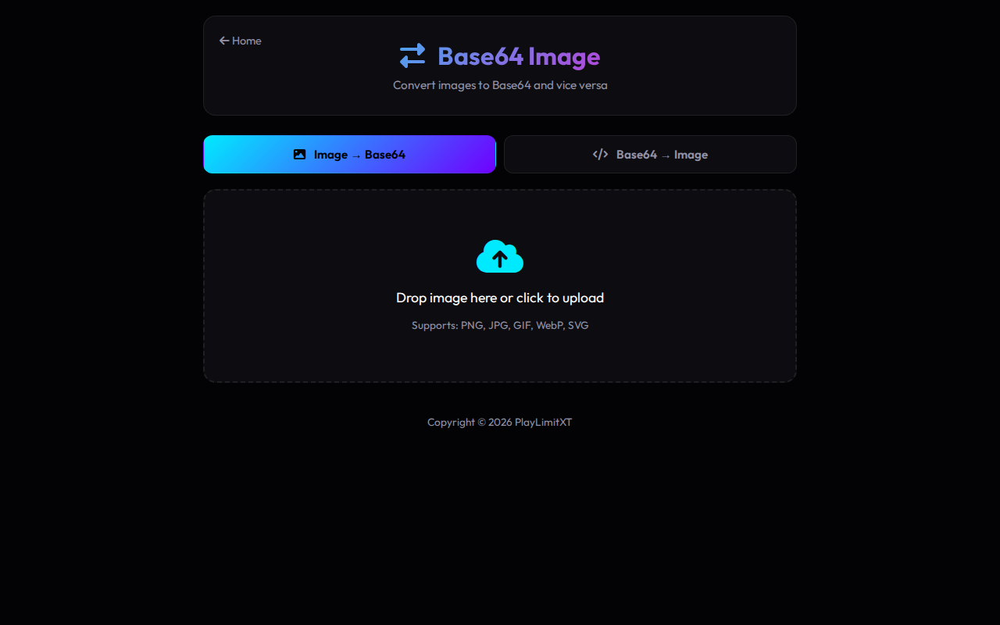

**English:** Convert images to Base64 encoded strings and vice versa. Supports PNG, JPG, GIF, WebP, and SVG formats. Perfect for embedding images directly in HTML, CSS, or JSON files.

**中文:** 将图片转换为Base64编码字符串，反之亦然。支持PNG、JPG、GIF、WebP和SVG格式。非常适合直接在HTML、CSS或JSON文件中嵌入图片。

**Features 功能:**
- Drag & drop upload 拖拽上传
- Preview before conversion 转换前预览
- One-click copy 一键复制
- Download as file 下载为文件

**Link 链接:** [/Project/Base64-Image/index.html](/Project/Base64-Image/index.html)

---

### 3. HTML Runner | HTML 运行器

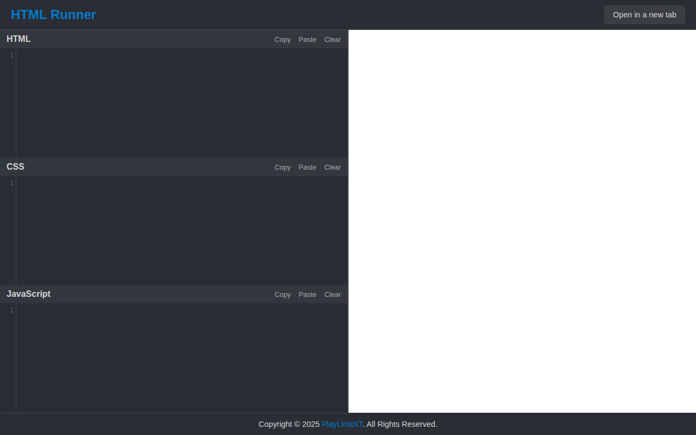

**English:** A real-time HTML/CSS/JS editor with live preview. Write code in the split-pane editor and see results instantly. Perfect for quick prototyping and learning web development.

**中文:** 一个实时HTML/CSS/JS编辑器，带即时预览功能。在分栏编辑器中编写代码，立即查看结果。非常适合快速原型开发和学习Web开发。

**Features 功能:**
- Split-pane editor 分栏编辑器
- Live preview 实时预览
- CodeMirror integration CodeMirror集成
- Open in new tab 在新标签页打开

**Tech Stack 技术栈:** CodeMirror 5

**Link 链接:** [/Project/HTML_Runner/index.html](/Project/HTML_Runner/index.html)

---

### 4. JSON Formatter | JSON 格式化

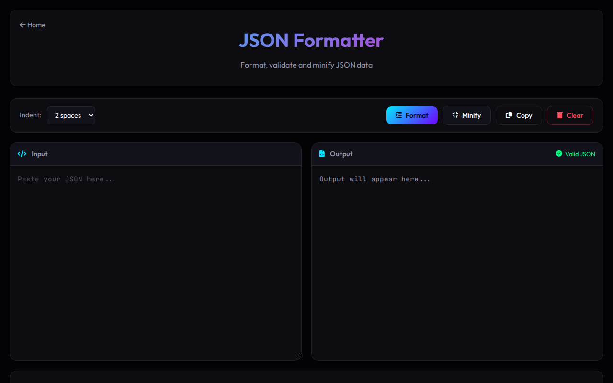

**English:** Format, validate, and minify JSON data with syntax highlighting. Displays detailed statistics including size, depth, key count, and value count.

**中文:** 格式化、验证和压缩JSON数据，带语法高亮。显示详细统计信息，包括大小、深度、键数量和值数量。

**Features 功能:**
- Instant formatting 即时格式化
- Error detection 错误检测
- Size statistics 大小统计
- Minify output 压缩输出

**Link 链接:** [/Project/JSON-Formatter/index.html](/Project/JSON-Formatter/index.html)

---

### 5. Markdown Editor | Markdown 编辑器

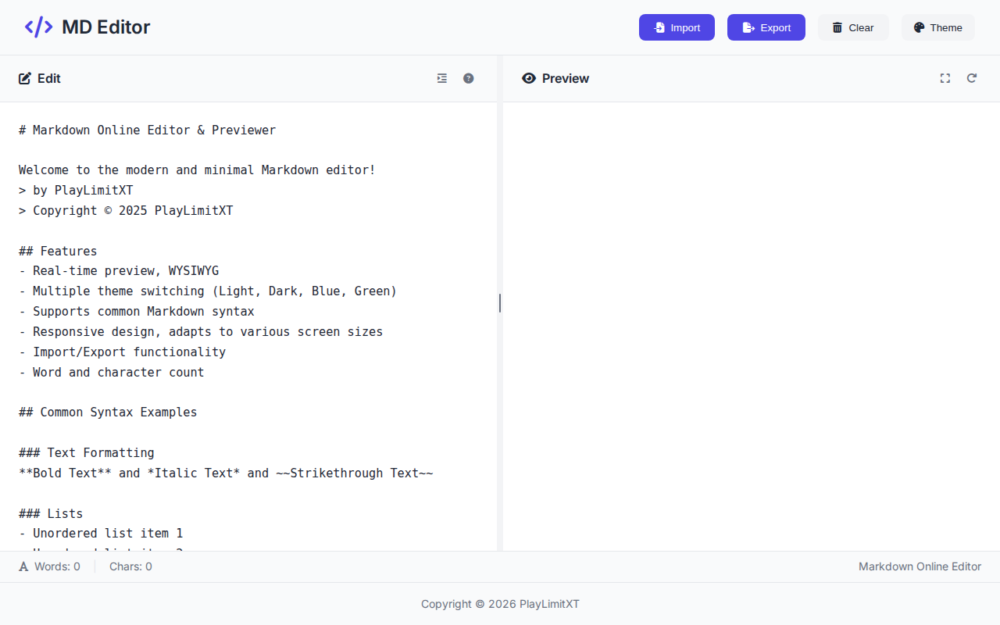

**English:** A full-featured Markdown editor with live preview. Supports multiple themes (Light, Dark, Blue, Green), import/export functionality, and real-time word counting.

**中文:** 一个功能完整的Markdown编辑器，带实时预览。支持多种主题（浅色、深色、蓝色、绿色），导入/导出功能和实时字数统计。

**Features 功能:**
- Real-time preview 实时预览
- Multiple themes 多种主题
- Import/Export 导入/导出
- Word count 字数统计
- Resizable panels 可调整面板大小

**Tech Stack 技术栈:** Marked.js

**Link 链接:** [/Project/Markdown/index.html](/Project/Markdown/index.html)

---

### 6. Regex Tester | 正则表达式测试

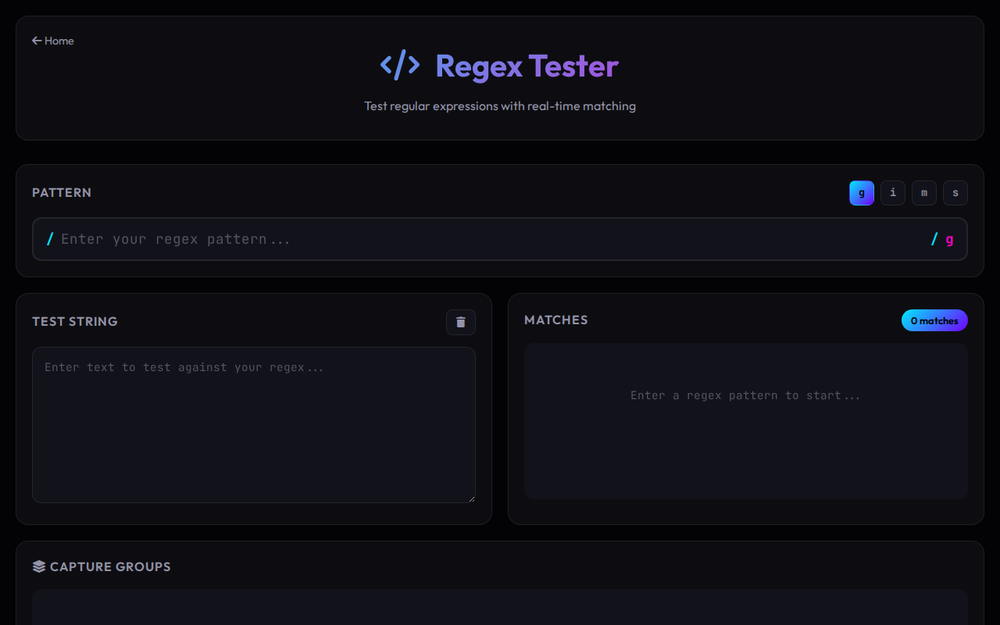

**English:** Test regular expressions with real-time matching and capture group visualization. Includes a quick reference guide for common regex patterns.

**中文:** 测试正则表达式，实时匹配和捕获组可视化。包含常用正则表达式模式的快速参考指南。

**Features 功能:**
- Real-time matching 实时匹配
- Flag support (g, i, m, s) 标志支持
- Capture groups 捕获组显示
- Quick reference 快速参考

**Link 链接:** [/Project/Regex-Tester/index.html](/Project/Regex-Tester/index.html)

---

### 7. SVG Viewer | SVG 查看器

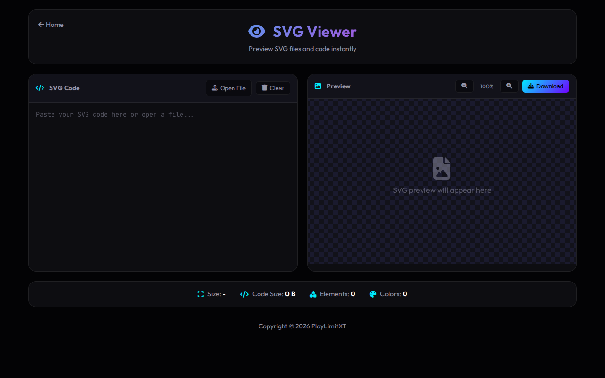

**English:** Preview SVG files and code instantly. Supports zoom controls, file upload, and provides detailed information about SVG elements and colors.

**中文:** 即时预览SVG文件和代码。支持缩放控制、文件上传，并提供SVG元素和颜色的详细信息。

**Features 功能:**
- Code preview 代码预览
- Zoom controls 缩放控制
- Element count 元素统计
- Color extraction 颜色提取

**Link 链接:** [/Project/SVG-Viewer/index.html](/Project/SVG-Viewer/index.html)

---

### 8. Word Counter | 字数统计

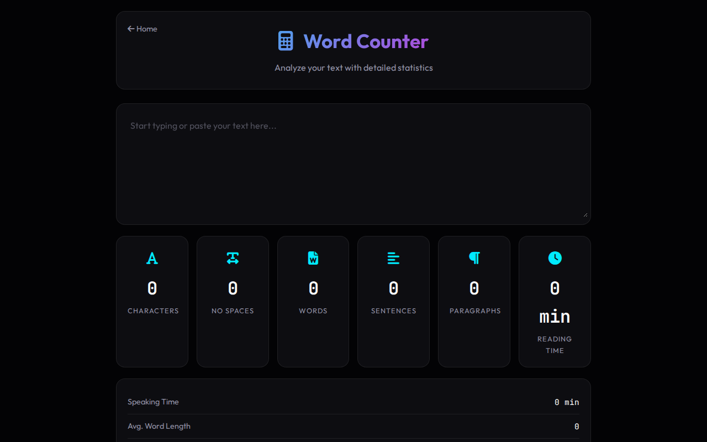

**English:** Comprehensive text analysis tool. Count characters, words, sentences, paragraphs, and estimate reading/speaking time.

**中文:** 全面的文本分析工具。统计字符数、单词数、句子数、段落数，并估算阅读/演讲时间。

**Features 功能:**
- Character count 字符统计
- Word count 单词统计
- Reading time 阅读时间
- Average word length 平均词长

**Link 链接:** [/Project/Word-Counter/index.html](/Project/Word-Counter/index.html)

---

## Security Tools 安全工具

### 9. Crypto Tools | 加密工具

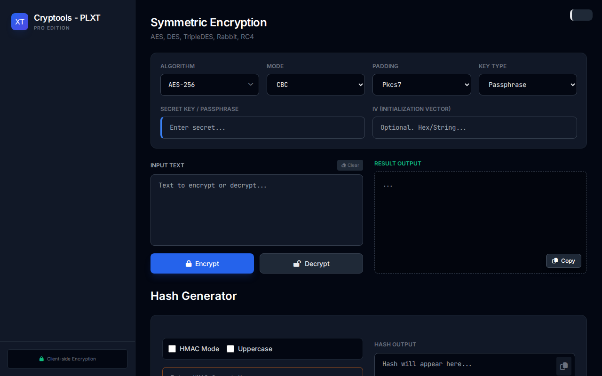

**English:** A comprehensive cryptography toolkit featuring symmetric encryption (AES, DES, TripleDES, Rabbit, RC4), hashing (MD5, SHA-1, SHA-256, SHA-512), RSA asymmetric encryption, and Base64/Hex encoding.

**中文:** 全面的加密工具包，具有对称加密（AES、DES、TripleDES、Rabbit、RC4）、哈希（MD5、SHA-1、SHA-256、SHA-512）、RSA非对称加密和Base64/Hex编码功能。

**Features 功能:**
- Symmetric encryption 对称加密
- Hash generation 哈希生成
- RSA encryption RSA加密
- HMAC support HMAC支持

**Tech Stack 技术栈:** CryptoJS, JSEncrypt, Alpine.js, Tailwind CSS

**Link 链接:** [/Project/Crypto/index.html](/Project/Crypto/index.html)

---

### 10. Password Generator | 密码生成器

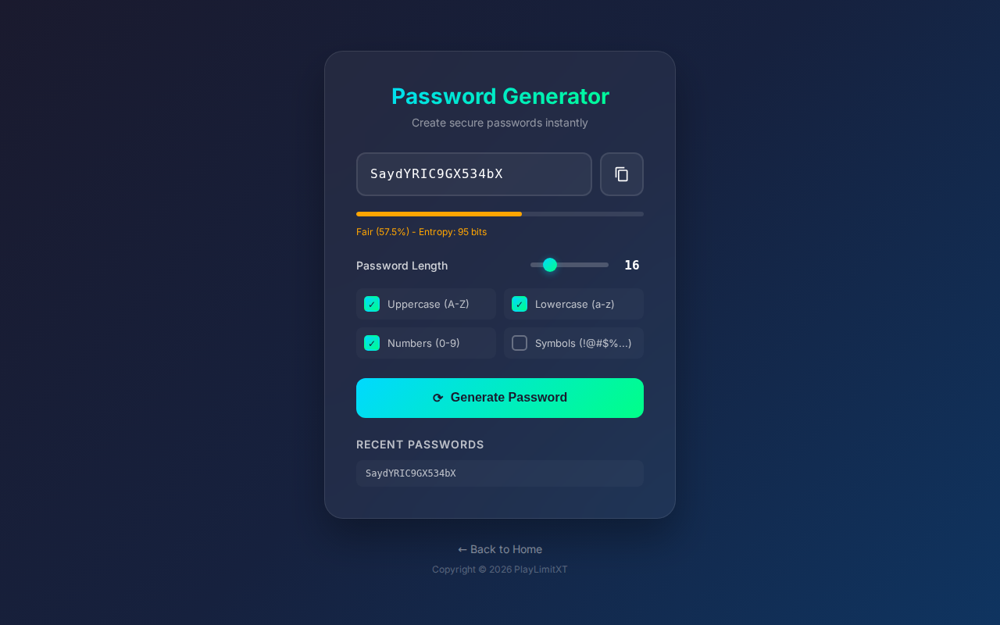

**English:** Generate secure passwords with customizable length and character sets. Includes a strength meter and history of recent passwords.

**中文:** 生成安全密码，可自定义长度和字符集。包含强度指示器和最近密码历史记录。

**Features 功能:**
- Customizable length 可自定义长度
- Character set options 字符集选项
- Strength meter 强度指示器
- Password history 密码历史

**Link 链接:** [/Project/Password-Generator/index.html](/Project/Password-Generator/index.html)

---

### 11. Password Analyzer | 密码分析器

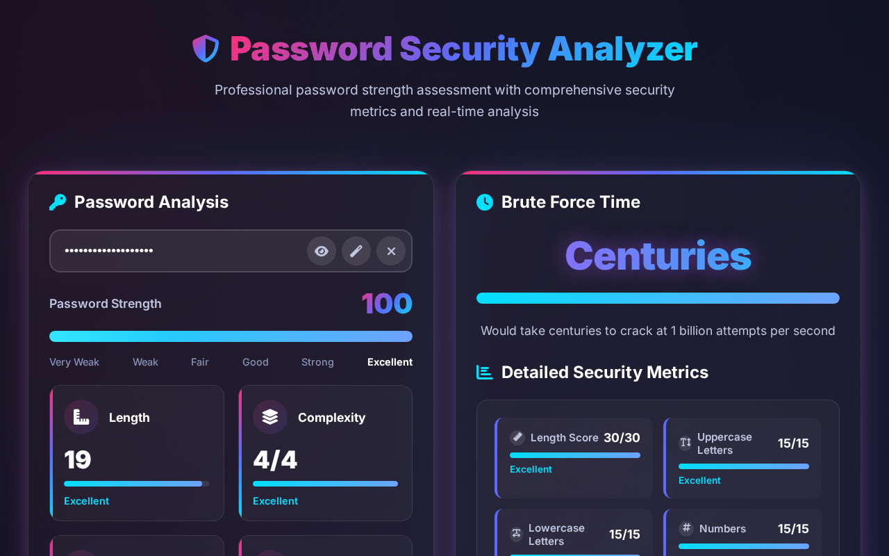

**English:** Professional password security analysis tool. Evaluates strength, entropy, patterns, and estimates brute-force cracking time with detailed metrics.

**中文:** 专业的密码安全分析工具。评估强度、熵值、模式，并估算暴力破解时间，提供详细指标。

**Features 功能:**
- Strength analysis 强度分析
- Entropy calculation 熵值计算
- Crack time estimation 破解时间估算
- Pattern detection 模式检测
- Export report 导出报告

**Link 链接:** [/Project/Pswd_Evaluation/index.html](/Project/Pswd_Evaluation/index.html)

---

### 12. Key Login | 密钥登录

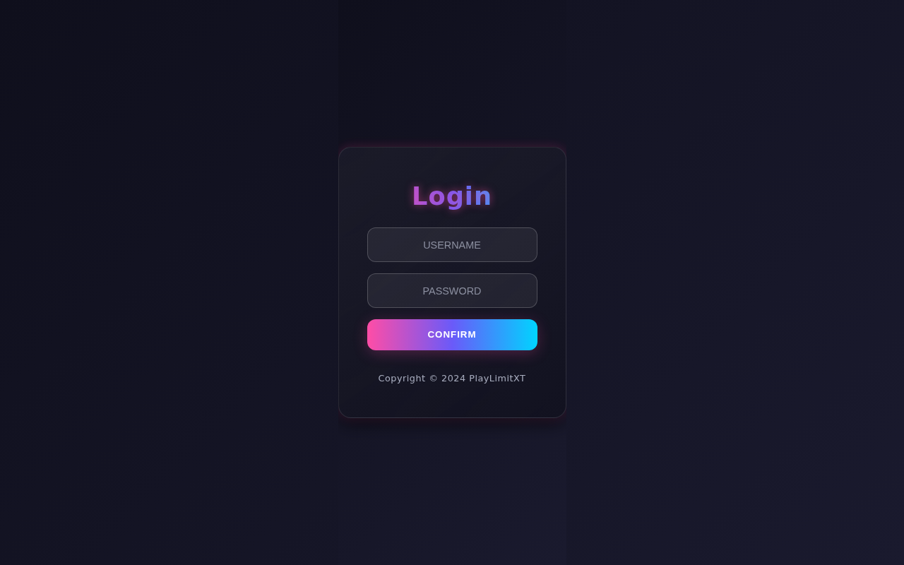

**English:** Client-side AES encryption login system. Decrypts and displays protected content using a password. Purely browser-based with no server communication.

**中文:** 客户端AES加密登录系统。使用密码解密并显示受保护内容。纯浏览器端，无服务器通信。

**Features 功能:**
- AES encryption AES加密
- Client-side only 纯客户端
- Secure content access 安全内容访问

**Tech Stack 技术栈:** CryptoJS

**Link 链接:** [/Project/Key/index.html](/Project/Key/index.html)

---

### 13. QR Code Generator | 二维码生成器

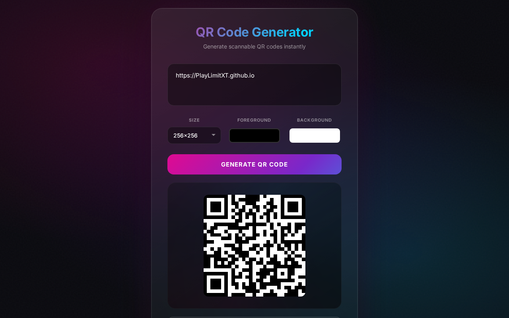

**English:** Generate customizable QR codes with adjustable size and colors. Supports downloading as PNG image.

**中文:** 生成可自定义的二维码，可调整大小和颜色。支持下载为PNG图片。

**Features 功能:**
- Custom size 自定义大小
- Color options 颜色选项
- PNG download PNG下载
- Instant generation 即时生成

**Link 链接:** [/Project/QR-Generator/index.html](/Project/QR-Generator/index.html)

---

### 14. UUID Generator | UUID 生成器

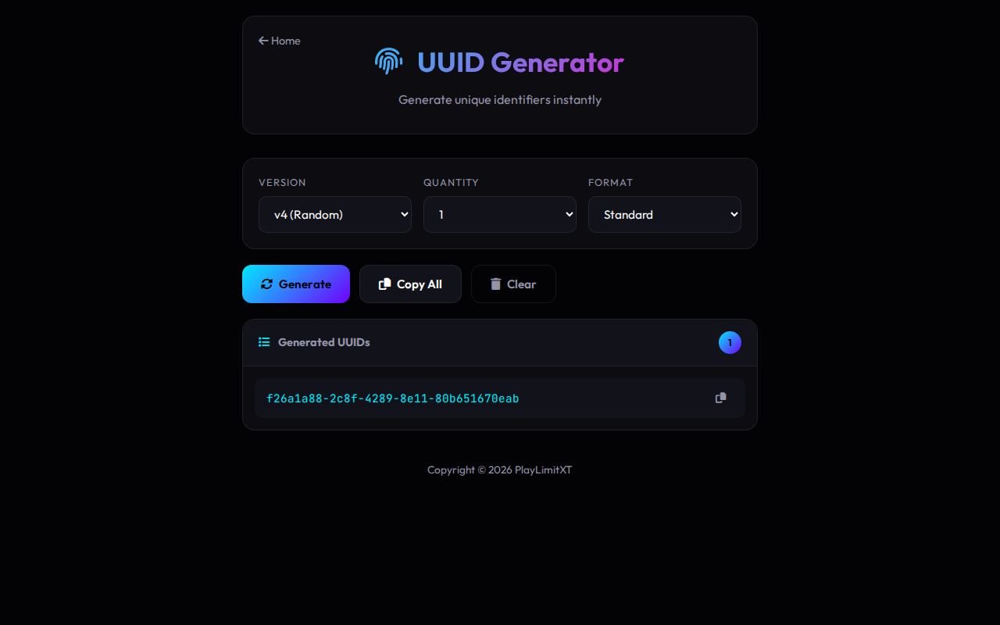

**English:** Generate UUIDs (Universally Unique Identifiers) in various formats. Supports v4 (random) and v1 (timestamp) versions.

**中文:** 以各种格式生成UUID（通用唯一标识符）。支持v4（随机）和v1（时间戳）版本。

**Features 功能:**
- v4 random UUID v4随机UUID
- v1 timestamp UUID v1时间戳UUID
- Batch generation 批量生成
- Multiple formats 多种格式

**Link 链接:** [/Project/UUID-Generator/index.html](/Project/UUID-Generator/index.html)

---

## Time & Productivity 时间与效率

### 15. Clock | 世界时钟

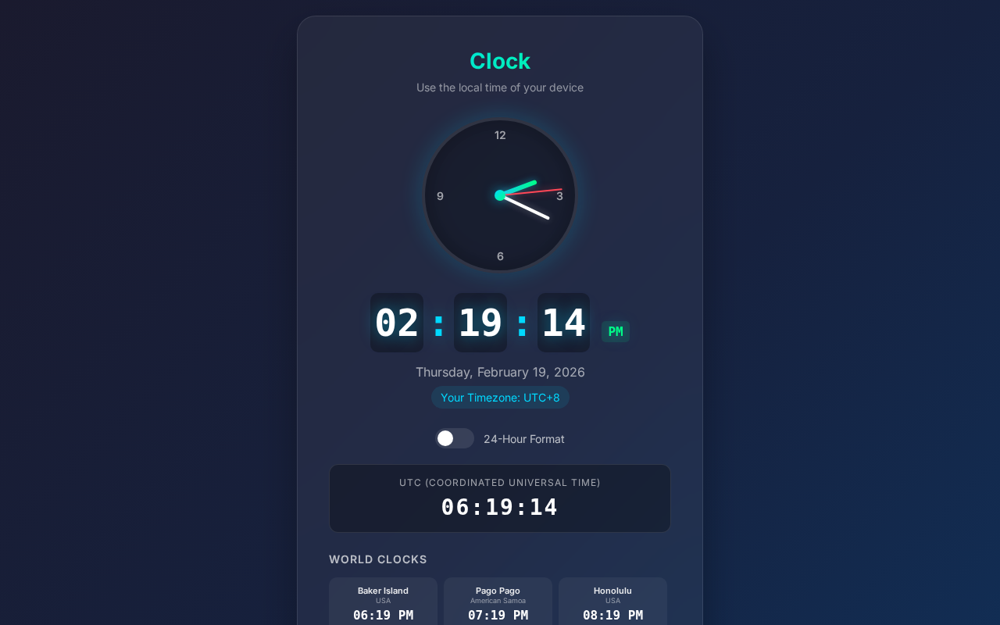

**English:** A beautiful world clock with analog and digital display. Shows local time, UTC, and multiple world time zones simultaneously.

**中文:** 精美的世界时钟，带模拟和数字显示。同时显示本地时间、UTC和多个世界时区。

**Features 功能:**
- Analog & digital 模拟和数字
- 12/24 hour format 12/24小时格式
- World time zones 世界时区
- UTC display UTC显示

**Link 链接:** [/Project/Clock/index.html](/Project/Clock/index.html)

---

### 16. Countdown Timer | 倒计时

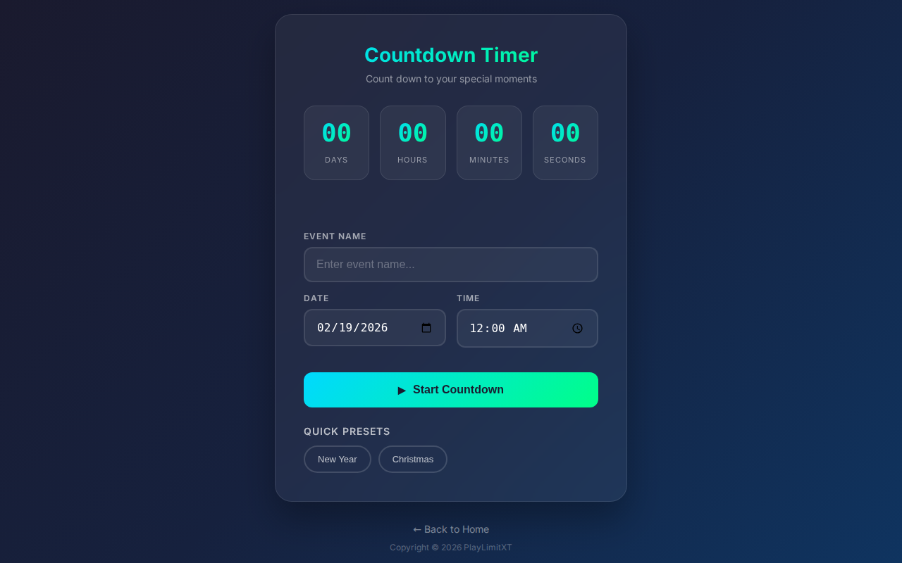

**English:** Countdown to important events with a beautiful interface. Includes quick presets for holidays like New Year and Christmas.

**中文:** 美观界面的事件倒计时。包含新年和圣诞节等节日的快速预设。

**Features 功能:**
- Custom events 自定义事件
- Quick presets 快速预设
- Visual countdown 可视化倒计时
- Days/hours/minutes/seconds 天/时/分/秒

**Link 链接:** [/Project/Countdown-Timer/index.html](/Project/Countdown-Timer/index.html)

---

### 17. Stopwatch | 秒表

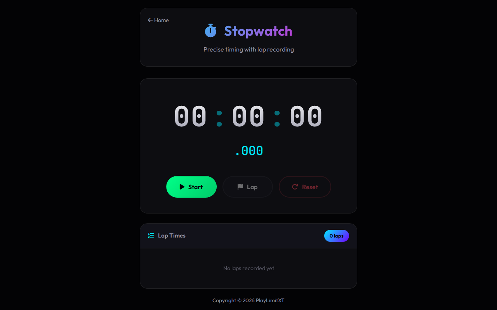

**English:** Precise stopwatch with lap recording. Millisecond accuracy for timing activities.

**中文:** 精确秒表，带计圈记录。毫秒级精度，适用于活动计时。

**Features 功能:**
- Millisecond precision 毫秒精度
- Lap recording 计圈记录
- Start/stop/reset 开始/停止/重置

**Link 链接:** [/Project/Stopwatch/index.html](/Project/Stopwatch/index.html)

---

### 18. Metronome | 节拍器

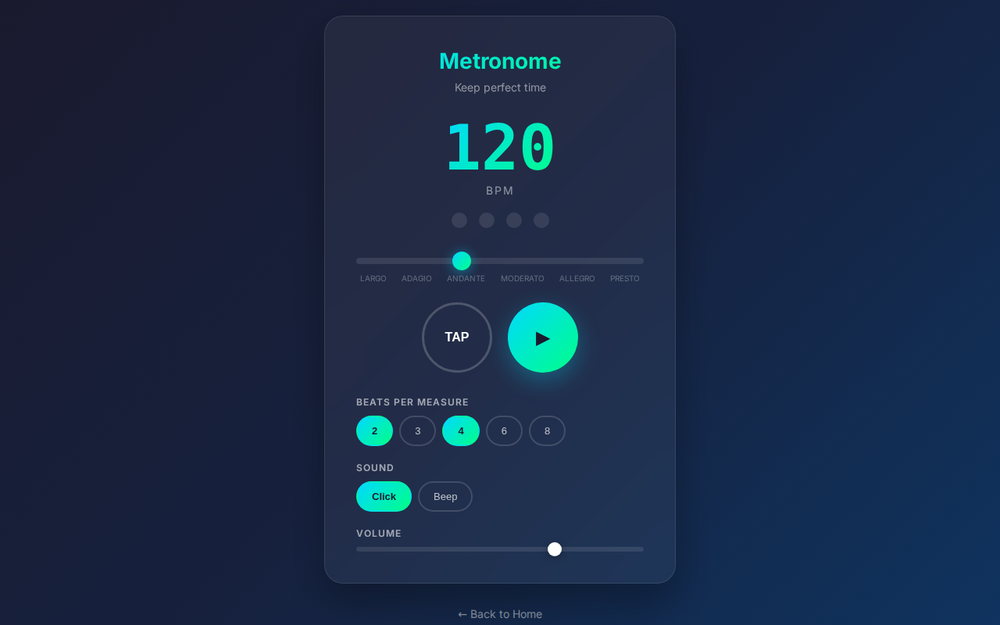

**English:** Keep perfect time with an adjustable BPM metronome. Features visual beat indicator and tap tempo.

**中文:** 可调节BPM的节拍器，保持完美节奏。具有视觉节拍指示器和点击节奏功能。

**Features 功能:**
- Adjustable BPM 可调节BPM
- Visual beat indicator 视觉节拍指示
- Tap tempo 点击节奏
- Beat patterns 节拍模式

**Link 链接:** [/Project/Metronome/index.html](/Project/Metronome/index.html)

---

### 19. Unix Timestamp | Unix 时间戳

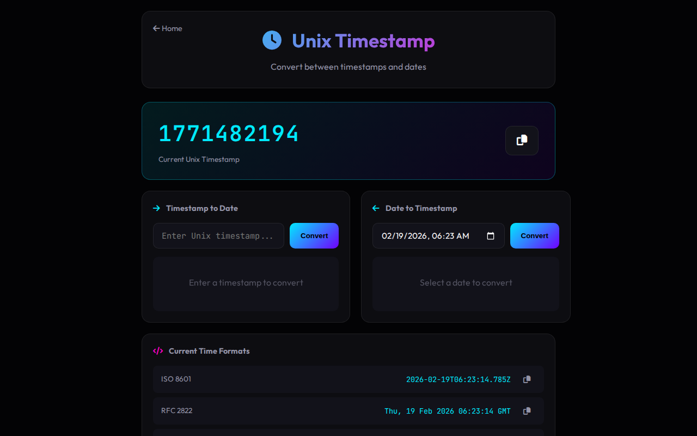

**English:** Convert between Unix timestamps and human-readable dates. Shows current timestamp in real-time with multiple format displays.

**中文:** Unix时间戳与可读日期之间的转换。实时显示当前时间戳，多种格式展示。

**Features 功能:**
- Real-time display 实时显示
- Timestamp to date 时间戳转日期
- Date to timestamp 日期转时间戳
- Multiple formats 多种格式

**Link 链接:** [/Project/Unix-Timestamp/index.html](/Project/Unix-Timestamp/index.html)

---

### 20. Check-In System | 打卡系统

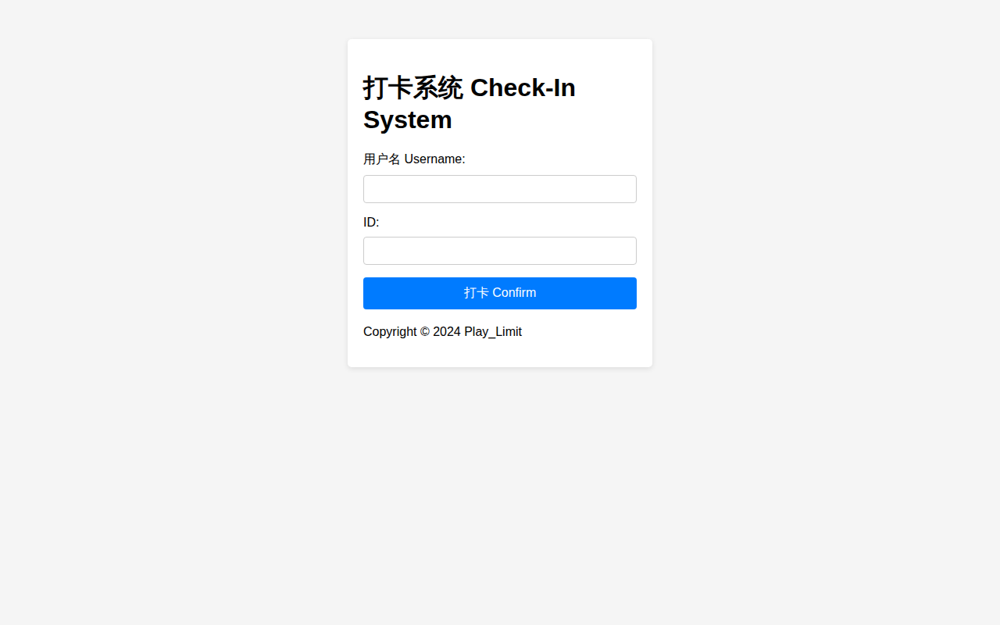

**English:** A simple employee check-in system for recording attendance. Browser-based with local storage.

**中文:** 简单的员工打卡系统，用于记录考勤。基于浏览器，使用本地存储。

**Features 功能:**
- Username/ID input 用户名/ID输入
- Timestamp recording 时间戳记录
- Local storage 本地存储

**Link 链接:** [/Project/Check-In-System/index.html](/Project/Check-In-System/index.html)

---

## Games & Entertainment 游戏娱乐

### 21. AI Chess | AI 国际象棋

**English:** Play chess against an AI opponent with adjustable difficulty levels (0-20). Features hint system, move history, evaluation bar, and PGN import/export.

**中文:** 与AI对手下棋，可调节难度级别（0-20）。具有提示系统、走法历史、评估条和PGN导入/导出功能。

**Features 功能:**
- AI opponent AI对手
- Difficulty levels 难度级别
- Hint system 提示系统
- PGN support PGN支持
- Evaluation bar 评估条

**Tech Stack 技术栈:** chessboard.js, chess.js

**Link 链接:** [/Project/Chess/index.html](/Project/Chess/index.html)

---

### 22. Chrome Dinosaur | 恐龙游戏

**English:** The classic Chrome offline dinosaur game. Jump over cacti and dodge obstacles to achieve the highest score.

**中文:** 经典的Chrome离线恐龙游戏。跳过仙人掌，躲避障碍物，获得最高分。

**Features 功能:**
- Classic gameplay 经典玩法
- Score tracking 分数追踪
- Keyboard controls 键盘控制

**Link 链接:** [/Project/Chrome-Dinosaur/index.html](/Project/Chrome-Dinosaur/index.html)

---

### 23. Rubik's Cube | 魔方

**English:** Interactive 3D Rubik's Cube simulator. Supports different cube sizes (2x2 to 5x5), multiple themes, and scramble functionality.

**中文:** 交互式3D魔方模拟器。支持不同魔方大小（2x2到5x5），多种主题和打乱功能。

**Features 功能:**
- Multiple sizes 多种大小
- 3D rotation 3D旋转
- Timer 计时器
- Statistics 统计数据
- Color themes 颜色主题

**Tech Stack 技术栈:** Three.js

**Link 链接:** [/Project/Rubik's Cube/index.html](/Project/Rubik's Cube/index.html)

---

### 24. 3D Cube | 3D 立方体

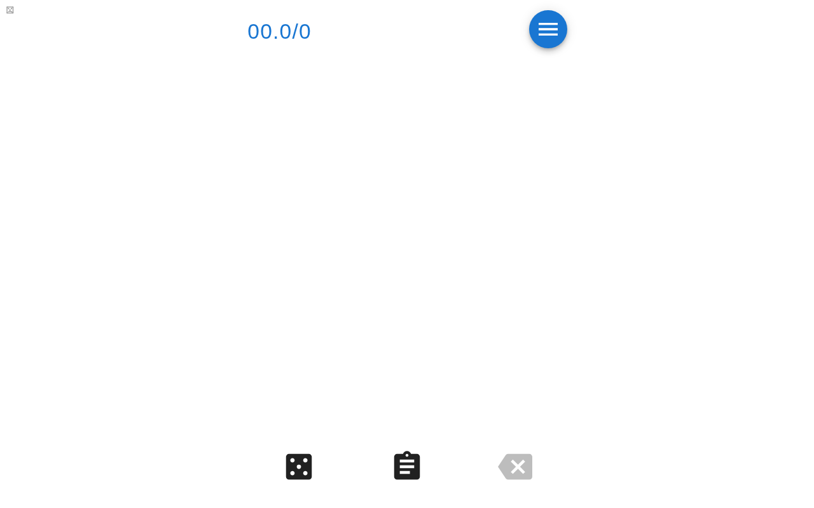

**English:** A mesmerizing 3D cube visualization with interactive rotation. Simple but visually appealing WebGL demonstration.

**中文:** 令人着迷的3D立方体可视化，带交互式旋转。简单但视觉吸引人的WebGL演示。

**Link 链接:** [/Project/Cube/index.html](/Project/Cube/index.html)

---

### 25. Reaction Test | 反应测试

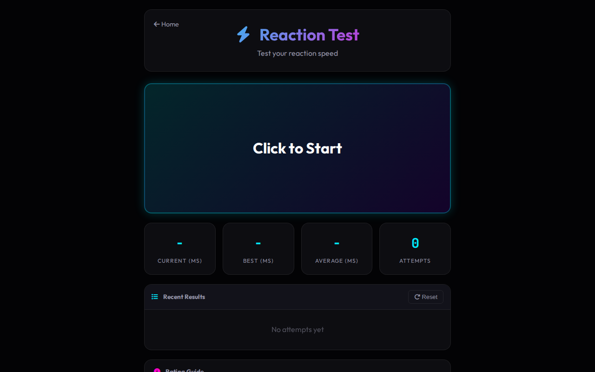

**English:** Test your reaction speed! Wait for the color change and click as fast as possible. Track your best time and average.

**中文:** 测试你的反应速度！等待颜色变化并尽快点击。追踪你的最佳时间和平均值。

**Features 功能:**
- Reaction time tracking 反应时间追踪
- Best time record 最佳时间记录
- Average calculation 平均值计算
- Rating guide 评级指南

**Link 链接:** [/Project/Reaction-Test/index.html](/Project/Reaction-Test/index.html)

---

## Utilities 实用工具

### 26. Color Picker | 取色器

**English:** Pick colors and convert between HEX, RGB, and HSL formats. Save your favorite colors to a palette.

**中文:** 选取颜色并在HEX、RGB和HSL格式之间转换。将喜欢的颜色保存到调色板。

**Features 功能:**
- Multiple formats 多种格式
- RGB sliders RGB滑块
- Color palette 颜色调色板
- Copy values 复制值

**Link 链接:** [/Project/Color-Picker/index.html](/Project/Color-Picker/index.html)

---

### 27. Keyboard Tester | 键盘测试

**English:** Test your keyboard keys visually. See key codes, locations, and track key presses in real-time.

**中文:** 可视化测试键盘按键。查看键码、位置，并实时追踪按键。

**Features 功能:**
- Visual keyboard 可视化键盘
- Key code display 键码显示
- Press tracking 按键追踪
- Statistics 统计数据

**Link 链接:** [/Project/Keyboard-Tester/index.html](/Project/Keyboard-Tester/index.html)

---

### 28. Random Number | 随机数生成

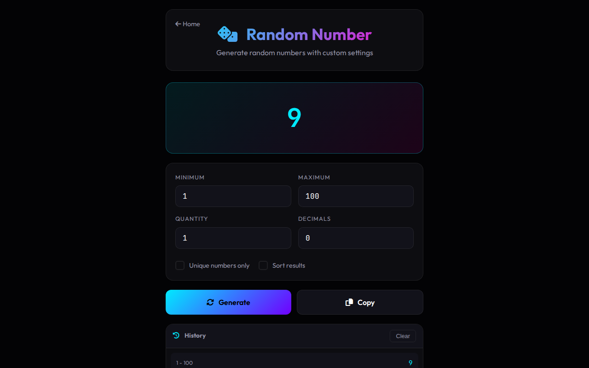

**English:** Generate random numbers within a custom range. Supports decimals, unique numbers, and sorting options.

**中文:** 在自定义范围内生成随机数。支持小数、唯一数字和排序选项。

**Features 功能:**
- Custom range 自定义范围
- Decimal support 小数支持
- Unique numbers 唯一数字
- Sort options 排序选项
- History 历史记录

**Link 链接:** [/Project/Random-Number/index.html](/Project/Random-Number/index.html)

---

### 29. Unicode Fonts | Unicode 字体

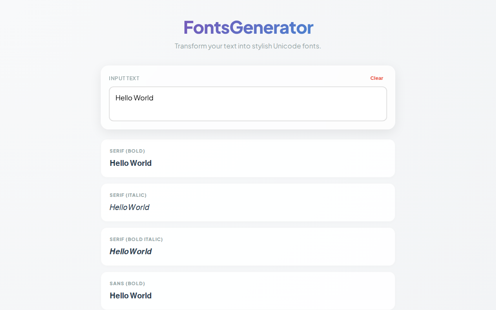

**English:** Transform your text into stylish Unicode fonts. Plenty different styles including bold, italic, script, gothic, circles, and more.

**中文:** 将文本转换为时尚的Unicode字体。多种不同风格，包括粗体、斜体、手写、哥特、圆圈等。

**Features 功能:**
- Font styles 多字体风格
- One-click copy 一键复制
- Instant preview 即时预览

**Link 链接:** [/Project/Unicode_Fonts/index.html](/Project/Unicode_Fonts/index.html)

---

### 30. User Agent Parser | UA 解析器

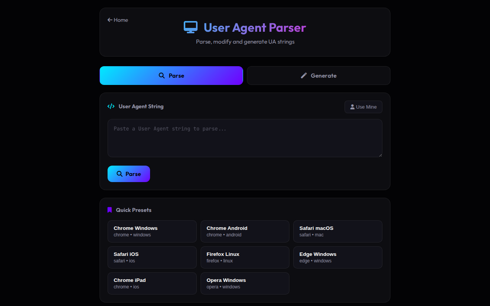

**English:** Parse User Agent strings to extract browser, OS, and device information. Also includes a UA generator for common browsers.

**中文:** 解析User Agent字符串以提取浏览器、操作系统和设备信息。还包含常用浏览器的UA生成器。

**Features 功能:**
- UA parsing UA解析
- UA generation UA生成
- Preset UA strings 预设UA字符串
- Copy/test 复制/测试

**Link 链接:** [/Project/User-Agent/index.html](/Project/User-Agent/index.html)

---

### 31. Web Log | 网站日志

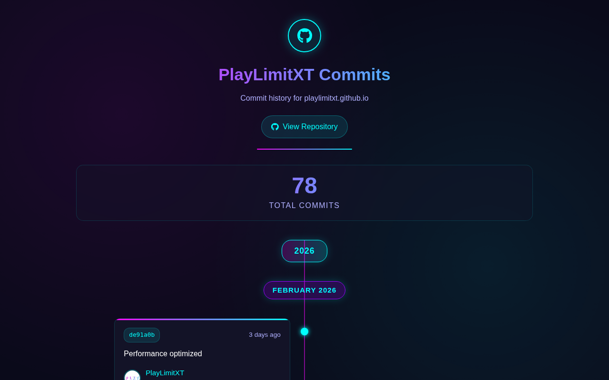

**English:** GitHub commit history viewer with a beautiful timeline. Shows commit details, author information, and statistics.

**中文:** 美观时间线的GitHub提交历史查看器。显示提交详情、作者信息和统计数据。

**Features 功能:**
- Commit timeline 提交时间线
- Author info 作者信息
- Statistics 统计数据
- GitHub API GitHub API

**Link 链接:** [/Project/Web_Log/index.html](/Project/Web_Log/index.html)

---

### 32. Website Versions | 网站版本

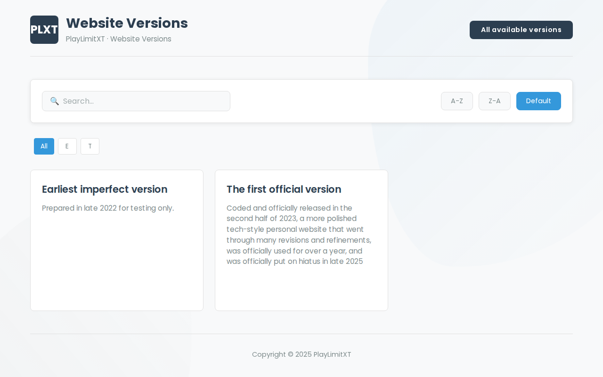

**English:** Archive of previous website versions. View the evolution of the PLXT website design over time.

**中文:** 以前网站版本的存档。查看PLXT网站设计随时间的演变。

**Features 功能:**
- Version archive 版本存档
- Design evolution 设计演变
- Historical view 历史查看

**Link 链接:** [/Project/Website_Versions/index.html](/Project/Website_Versions/index.html)

---

## Summary 总结

All 32 tools are designed to run entirely in the browser, requiring no server-side processing. This ensures:

所有32个工具都设计为完全在浏览器中运行，无需服务器端处理。这确保了：

- **Privacy 隐私保护**: Your data never leaves your browser 你的数据永远不会离开浏览器
- **Speed 速度**: Instant execution without network latency 即时执行，无网络延迟
- **Reliability 可靠性**: Works offline once loaded 加载后可离线工作
- **Accessibility 可访问性**: Access from any device with a browser 可从任何带浏览器的设备访问

---

## Technology Overview 技术概览

| Category 类别 | Technologies 技术栈 |
|--------------|-------------------|
| Frontend 前端 | Vanilla JavaScript, CSS3, HTML5 |
| Libraries 库 | Three.js, CodeMirror, Marked.js, Highlight.js |
| Security 安全 | CryptoJS, JSEncrypt |
| Games 游戏 | chessboard.js, chess.js |
| Styling 样式 | Tailwind CSS (CDN), Custom CSS |

---

## Links 链接

- **Website 网站**: [plxt.pages.dev](https://plxt.pages.dev)
- **GitHub**: [github.com/PlayLimitXT](https://github.com/PlayLimitXT)
- **Projects 项目导航**: [Link.html](../../Link.html)

---

*Copyright © 2026 PlayLimitXT. All rights reserved.*  
*版权所有 © 2026 PlayLimitXT。保留所有权利。*
